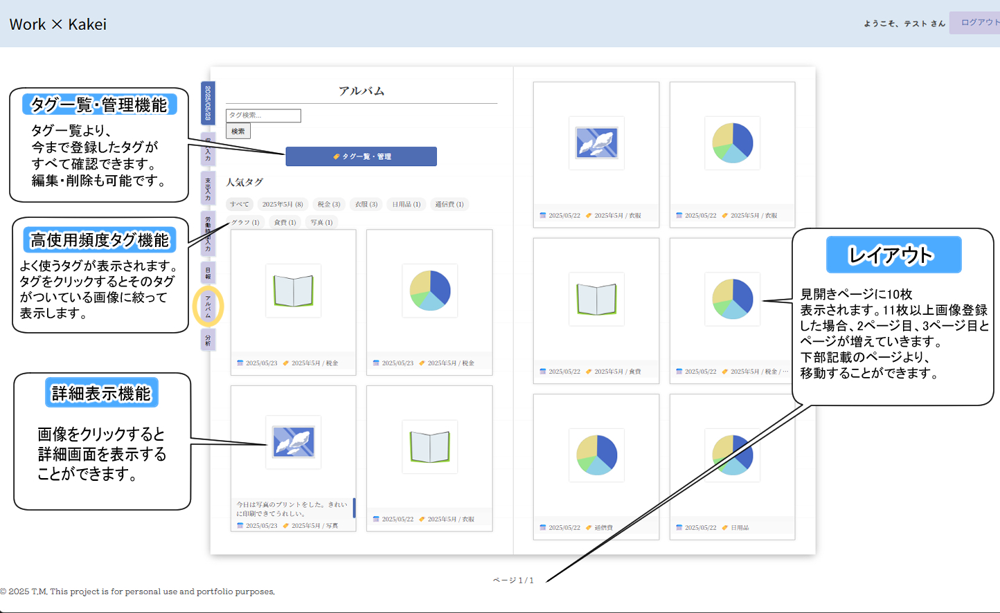
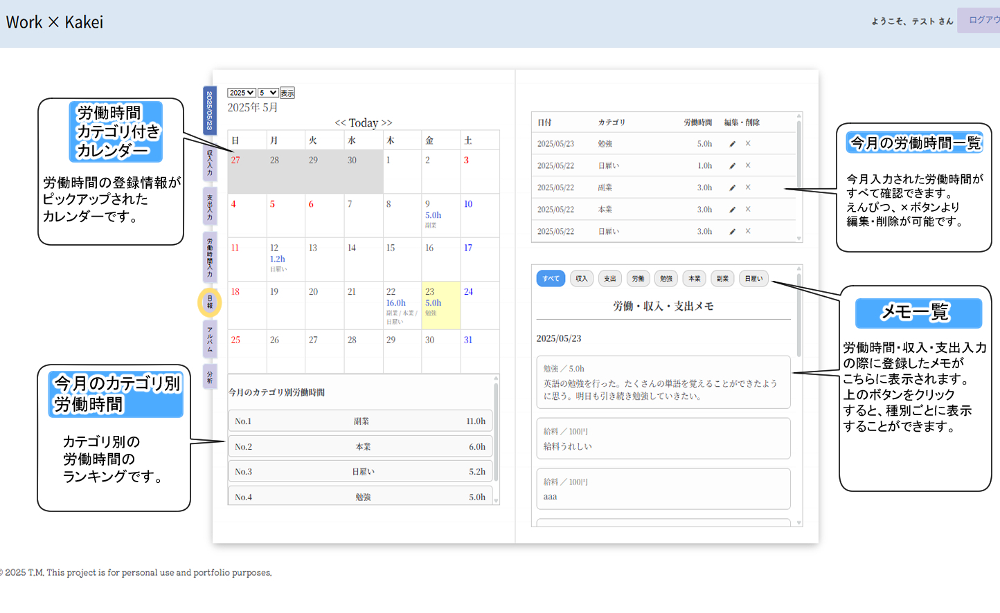
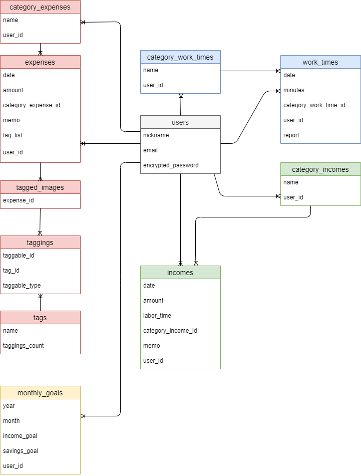
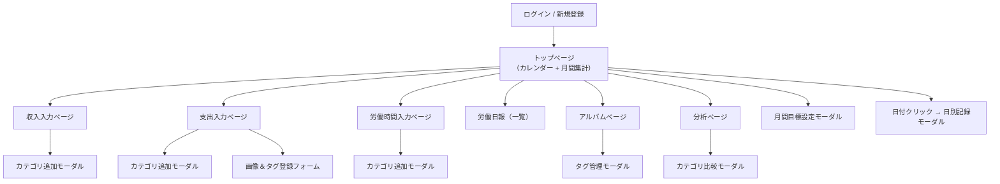

# 💼 Work × Kakei（家計簿・労働管理アプリ）

### 🛠️“働く”を記録する、“暮らし”が変わる。  
**労働に特化した、家計簿アプリ。**

このアプリは、**収入・支出・貯金**の記録に加えて、  
**労働時間の記録と分析**にも対応した**統合型の家計管理ツール**です。

- 📊 **カテゴリ別の集計**
- 🎯 **月間目標の設定と進捗管理**
- 🖼️ **タグ付き画像による視覚的な記録**

これらの機能を通じて、  
「**働き方と資産状況の関係性**」を可視化し、**継続的な生活改善**をサポートします。

生活の記録としての家計簿に、**“労働”という要素を掛け合わせることで**、  
**暮らしと働き方の両面から個人の経済活動を最適化**します。

---

## 🎯 制作背景


本アプリは、「働き方」と「暮らし方」を見つめ直せる家計管理ツールを作りたいという思いから制作しました。
物価の上昇や増税が進む現代において、従来のように節約だけで家計を支えることには限界を感じている方も多いのではないでしょうか。さらに、技術の進歩により仕事内容や求められるスキルは急速に変化し、終身雇用や安定した収入が当たり前ではなくなりつつある中で、将来への不安を感じることもあると思います。

そうした背景を踏まえ、家計を見直すには「支出を抑える」だけでなく、  
**“収入の質や働き方そのものを見直す”という視点が必要ではないか**と考えるようになりました。

そこで私は、**労働時間の記録・分析機能を備えた家計簿アプリ**を開発しました。  
収入・支出・貯金に加えて、どんな働き方をし、どのくらいの時間をかけて得た収入なのかを記録・可視化することで、**お金と労働のつながりを振り返ることができる家計管理ツール**を目指しています。


---


## 🌐 アプリURL

🔗 [https://work-kakei.onrender.com/](https://work-kakei.onrender.com/)

-  **Basic認証 ID**：`admin`  
-  **Basic認証 パスワード**：`0194`


## テスト用アカウント
-  **mail**：`tech@1`  
-  **パスワード**：`test0194`
---

## 📖 アプリの機能紹介

### 🔝 トップページ


### 🖼️ アルバムページ


### 📆 日報ページ


### 📊 分析ページ


## ✍️ 各機能の詳細

### 💰 収入の登録
- 初期カテゴリ：**給料／副収入／臨時収入**
- **最大5つまで自由にカテゴリ名をつけ追加可能**
- メモ欄あり（※日報ページに反映）

[](https://gyazo.com/282786303778cc5b3273ca1d654d1d6c)

---

### 💸 支出の登録
- 初期カテゴリ：**-食費 -外食費 -交通費 -衣服 -交際費 -通信費 -日用品 -税金 -医療費 -保険 -光熱費 -住居費 -趣味** 
- **最大10個までカテゴリ追加可能**
- **画像付き支出登録**が可能
- **画像に自動タグ付与機能（カテゴリ＋年月）あり**
- 登録された画像は、アルバムにまとめられ、**タグごとの表示切り替えが可能**
- 任意の**タグ追加・削除**
- メモ欄あり（※日報・アルバム両ページに反映）

[](https://gyazo.com/ced9f7b4f1c6119ff61cdce4afaeb900)

---

### ⏱️ 労働時間の登録
- 初期カテゴリ：**本業／副業／日雇い**
- **最大5つまで追加可能**
- メモ欄あり（※日報ページに反映）

[](https://gyazo.com/f9ac2ab9a65673f1003aa10fa37d3de0)

---

### 🎯 目標設定（収入・貯金）
- **月単位での収入・貯金目標の設定**
- **進捗率をメーターで表示（最大300％まで）**
- 達成率が視覚的に把握可能

[](https://gyazo.com/fd6f8b8b296a64c31d13b4633ca1b2ea)

---


### 📈 分析ページ
- 年間単位で以下を集計・表示：
  - 収入／支出／貯金額
  - 総労働時間
  - カテゴリ別労働時間
  - 各項目の年間割合
- **グラフと表で可視化された分析ページ**

[](https://gyazo.com/61d14a1bda66357f08b48c821cf2277a)

---
## 🧩 使用感・補助機能

### 📅 日付別詳細 ＆ 📉 先月比較モーダル
- **カレンダークリックで当日の登録内容を一覧表示**
- **先月比で収支の変動と変化の大きいカテゴリを通知**

[](https://gyazo.com/942db310cbf9e0265c803236734db3e4)

---

### 📝 日報ページのメモフィルタ
- **カテゴリ別にメモを絞り込み表示**
- **長文メモは「続きを読む」ボタンで全文表示**

[](https://gyazo.com/03b128e218a0cc8cdd5dddf623413b64)

---

### 🏷️ アルバムのタグ管理機能
- **使用頻度の高いタグを上位10件表示**
- **タグクリックで画像の絞り込み**
- **タグの一括削除・編集・一覧管理が可能**

[](https://gyazo.com/36bfac2e3ab9b74332c2493b1b728127)

---

## 🌟 工夫した点（UI/UX・操作性）
このアプリは、ただ数字を記録するだけでなく、日々の暮らしを「綴る」ような体験を目指してデザインしています。
ノートに直接書き込んでいるかのようなデザインと、迷わず、気持ちよく使えるUI/UXを実現するために、以下の点にこだわりました。
- **ノート風デザイン**を採用し、より家計簿らしい見た目にしつつ多機能に仕上げ、デザインと実用性を両立。全ページに見出しタブを配置し、どこからでも主要機能にスムーズに移動できるよう設計しました。
- 操作ボタンには**絵文字（鉛筆・×）＋ホバー表示のラベル**を併用し、何ができるかを直感的に伝えるUIにしています。
- **カレンダー上の日付にホバー時の色変化**を加え、クリック可能であることを視覚的に示しています。
- **支出登録時に画像プレビュー**を表示することで、アップロード前に内容を確認できるようにしています。
- 登録された画像には**カテゴリ名と登録年月の自動タグ付け機能**を実装。加えて、**ユーザーが自由にタグを追加・削除できる**仕様にしています。また**全角英数字を自動で半角に変換**し、タグ表記のゆれや重複を防止しています。
- 収入・支出・労働時間の各カテゴリは**モーダル操作で追加・編集・削除が可能**で、登録作業の流れを妨げません。
- 月間目標の進捗は、**0〜300％まで表示されるメーター**で視覚的に達成度を確認できるようにしました。
- 分析ページでは、**年間の集計表**と**グラフ表示**を両方設置することにより、比較のしやすさを高めています。


## 🛠️制作期間
### 作業日 
4月29日～5月16日（主要機能の実装）
5月19日～5月23日（調整）
実作業日数 21日
---
## 🏗️ 主な使用技術

* 💎 **言語**: Ruby 3.2.0  
* 📜 **言語**: JavaScript  
* 🧰 **フレームワーク**: Ruby on Rails 7.1.0  
* 🔐 **認証**: Devise  
* 🗄️ **データベース**: MySQL（開発） / PostgreSQL（本番）  
* 🖼️ **ファイル添付**: ActiveStorage  
* 🏷️ **タグ機能**: acts-as-taggable-on  
* 📊 **グラフ描画**: Chartkick + Groupdate  
* 📅 **カレンダー表示**: simple_calendar  
* 🎨 **CSS/UI**: CSS  
* 🚀 **デプロイ環境**: Render  
* ✅ **テスト**: RSpec(モデルのテスト済み) 
* 🗂️ **バージョン管理**: GitHub  
  
---

## 📦 モデル構成と概要

### 👤 User（ユーザー）

* Deviseで管理されるアカウント
* 各種データの所有者

```ruby
has_many :expenses
has_many :incomes
has_many :work_times
has_many :monthly_goals
has_many :category_expenses
has_many :category_incomes
has_many :category_work_times
```

---

### 💰 Income（収入）

* 金額・カテゴリ・労働時間・メモの登録が可能

| カラム名                 | 型         | Options         | Constraints           |
| -------------------- | --------- | --------------- | --------------------- |
| date                 | date      | null: false     | 必須                    |
| amount               | integer   | null: false     | 0円以上、最大2,147,483,647円 |
| category_income_id   | integer   | null: false, FK | カテゴリID            |
| memo                 | text      |                 | 任意、300文字以内            |
| user_id              | reference | null: false, FK | 所属ユーザー                |

```ruby
belongs_to :user
belongs_to :category_income
```

### 💸 Expense（支出）

* 金額・カテゴリ・メモの登録が可能
* タグ付き画像を複数登録可能

| カラム名                  | 型         | Options         | Constraints  |
| --------------------- | --------- | --------------- | ------------ |
| date                  | date      | null: false     | 必須           |
| amount                | integer   | null: false     | 0円以上         |
| category_expense_id   | integer   | null: false, FK | カテゴリID   |
| memo                  | text      |                 | 任意、300文字以内   |
| tag_list              | string    |                 | カンマ区切りの任意タグ群(画像ありの場合) |
| user_id               | reference | null: false, FK | 所属ユーザー       |

```ruby
belongs_to :user
belongs_to :category_expense
has_many :tagged_images
```

---

### ⏱️ WorkTime（労働時間）

* 日別の労働記録
* 労働日報を記録できる

| カラム名                     | 型         | Options         | Constraints      |
| ------------------------ | --------- | --------------- | ---------------- |
| date                     | date      | null: false     | 必須               |
| minutes                  | integer   | null: false     | 1分以上、整数          |
| category_work_time_id    | integer   | optional, FK    | カテゴリID |
| user_id                  | reference | null: false, FK | 所属ユーザー           |
| report                   | text |               | 所属ユーザー           |

```ruby
belongs_to :user
belongs_to :category_work_time
```
---

### 🏷️ TaggedImage（画像付きタグ）

* 支出と紐づいた画像＋タグ

```ruby
has_one_attached :image
acts_as_taggable_on :tags
belongs_to :expense
```

| カラム名        | 型             | Options         | Constraints       |
| ----------- | ------------- | --------------- | ----------------- |
| image       | ActiveStorage |                 |  |
| tag_list    | string        |                 | |
| expense_id  | integer       | null: false, FK | 支出と関連付け           |

---


### 🎯 MonthlyGoal（月間目標）

* 収入・貯金の目標を月単位で管理

```ruby
belongs_to :user
```

| カラム名          | 型         | Options                             | Constraints |
| ------------- | --------- | ----------------------------------- | ----------- |
| year          | integer   | null: false                         | 2000年以降     |
| month         | integer   | null: false                         | 1〜12        |
| income_goal  | integer   | allow_nil                          | 0円以上        |
| savings_goal | integer   | allow_nil                          | 0円以上        |
| user_id      | reference | null: false, unique by year & month | 月ごとに1件まで    |

---

### 📚 Category Models（カテゴリ共通仕様）

#### CategoryIncome / CategoryExpense / CategoryWorkTime

* 共通カテゴリは削除不可
* ユーザーごとに作成上限あり
* 名前20文字以内、重複不可

| カラム名     | 型         | Options      | Constraints    |
| -------- | --------- | ------------ | -------------- |
| name     | string    | null: false  | 一意（同一ユーザー内）    |
| user_id | reference | optional, FK | nil の場合は共通カテゴリ |

```ruby 
CategoryIncome
belongs_to :user
has_many :incomes
```
```ruby
CategoryExpense
belongs_to :user
has_many :expenses
```
```ruby
 CategoryWorkTime
belongs_to :user
has_many :work_times
```
---
## 🗂️ ER図


---

## 🧭 画面遷移図



## 🚀 今後の実装予定

### 📱 モバイル対応の強化（レスポンシブデザイン）  
  外出先でも快適に使えるよう、スマートフォンでの表示最適化を進めていきたいです。

### 🛡️ セキュリティ強化予定

- **2段階認証の導入**  
  より安心して利用できるよう、アカウント保護の強化を検討しています。

- **ソーシャルログイン（Google・Appleなど）の対応**  
  パスワードレスな選択肢を取り入れ、利便性と安全性の両立を図ります。

---

##  制作者

* T・M（個人学習・ポートフォリオ用途）

---
