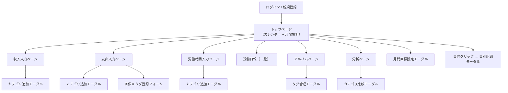

# 💼 Work × Kakei（家計簿・労働管理アプリ）
### 🛠️“働く”を記録する、“暮らし”が変わる。労働特化型家計簿アプリ🛠️
このアプリは、収入・支出・貯金の記録に加え、労働時間の管理と分析にも対応した統合型の家計管理ツールです。
カテゴリ別の集計や月間目標設定、タグ付き画像による視覚的な記録補助を通じて、働き方と資産状況の関連性を可視化し、継続的な改善を支援します。
家計簿に労働記録の機能を組み合わせることで、生活と労働の両面から個人の経済活動を最適化します。

---

## 🏗️ 主な使用技術

* 💎 **言語**: Ruby 3.2.0  
* 📜 **言語**: JavaScript  
* 🧰 **フレームワーク**: Ruby on Rails 7.1.0  
* 🔐 **認証**: Devise  
* 🗄️ **データベース**: MySQL（開発） / PostgreSQL（本番）  
* 🖼️ **ファイル添付**: ActiveStorage  
* 🏷️ **タグ機能**: acts-as-taggable-on  
* 📊 **グラフ描画**: Chartkick + Groupdate  
* 📅 **カレンダー表示**: simple_calendar  
* 🎨 **CSS/UI**: TailwindCSS（一部カスタム）  
* 🚀 **デプロイ環境**: Render  
* 🗂️ **バージョン管理**: GitHub  
  
---

## 📦 モデル構成と概要

### 👤 User（ユーザー）

* Deviseで管理されるアカウント
* 各種データの所有者

```ruby
has_many :expenses
has_many :incomes
has_many :work_times
has_many :monthly_goals
has_many :category_expenses
has_many :category_incomes
has_many :category_work_times
```

---

### 💰 Income（収入）

* 金額・カテゴリ・労働時間の登録が可能

| カラム名                 | 型         | Options         | Constraints           |
| -------------------- | --------- | --------------- | --------------------- |
| date                 | date      | null: false     | 必須                    |
| amount               | integer   | null: false     | 0円以上、最大2,147,483,647円 |
| labor_time           | integer   |                 | 任意（時間単位）              |
| category_income_id   | integer   | null: false, FK | 存在するカテゴリID            |
| memo                 | text      |                 | 任意、300文字以内            |
| user_id              | reference | null: false, FK | 所属ユーザー                |

```ruby
belongs_to :user
has_many :incomes
has_many :work_times
```

### 💸 Expense（支出）

* タグ付き画像を複数登録可能

| カラム名                  | 型         | Options         | Constraints  |
| --------------------- | --------- | --------------- | ------------ |
| date                  | date      | null: false     | 必須           |
| amount                | integer   | null: false     | 0円以上         |
| category_expense_id   | integer   | null: false, FK | 存在するカテゴリID   |
| memo                  | text      |                 | 任意、300文字以内   |
| tag_list              | string    |                 | カンマ区切りの任意タグ群 |
| user_id               | reference | null: false, FK | 所属ユーザー       |

```ruby
belongs_to :user
belongs_to :category_expense
has_many :tagged_images
```

---

### ⏱️ WorkTime（労働時間）

* 日別の労働記録（分単位）

| カラム名                     | 型         | Options         | Constraints      |
| ------------------------ | --------- | --------------- | ---------------- |
| date                     | date      | null: false     | 必須               |
| minutes                  | integer   | null: false     | 1分以上、整数          |
| category_work_time_id    | integer   | optional, FK    | 存在するカテゴリID（0は不可） |
| user_id                  | reference | null: false, FK | 所属ユーザー           |
| report                   | text |               | 所属ユーザー           |

```ruby
belongs_to :user
belongs_to :category_work_time
```
---

### 🏷️ TaggedImage（画像付きタグ）

* 支出と紐づいた画像＋タグ

```ruby
has_one_attached :image
acts_as_taggable_on :tags
belongs_to :expense
```

| カラム名        | 型             | Options         | Constraints       |
| ----------- | ------------- | --------------- | ----------------- |
| image       | ActiveStorage |                 | 任意（ただしタグがある場合は必須） |
| tag_list    | string        |                 | 画像またはタグどちらか必須     |
| expense_id  | integer       | null: false, FK | 支出と関連付け           |

---


### 🎯 MonthlyGoal（月間目標）

* 収入・貯金の目標を月単位で管理

```ruby
belongs_to :user
```

| カラム名          | 型         | Options                             | Constraints |
| ------------- | --------- | ----------------------------------- | ----------- |
| year          | integer   | null: false                         | 2000年以降     |
| month         | integer   | null: false                         | 1〜12        |
| income_goal  | integer   | allow_nil                          | 0円以上        |
| savings_goal | integer   | allow_nil                          | 0円以上        |
| user_id      | reference | null: false, unique by year & month | 月ごとに1件まで    |

---

### 📚 Category Models（カテゴリ共通仕様）

#### CategoryIncome / CategoryExpense / CategoryWorkTime

* 共通カテゴリは削除不可
* ユーザーごとに作成上限あり
* 名前20文字以内、重複不可

| カラム名     | 型         | Options      | Constraints    |
| -------- | --------- | ------------ | -------------- |
| name     | string    | null: false  | 一意（同一ユーザー内）    |
| user_id | reference | optional, FK | nil の場合は共通カテゴリ |

```ruby 
CategoryIncome
belongs_to :user
has_many :incomes
```
```ruby
CategoryExpense
belongs_to :user
has_many :expenses
```
```ruby
 CategoryWorkTime
belongs_to :user
has_many :work_times
```
---

## 🧭 画面遷移図



---

##  制作者

* T・M（個人学習・ポートフォリオ用途）

---
