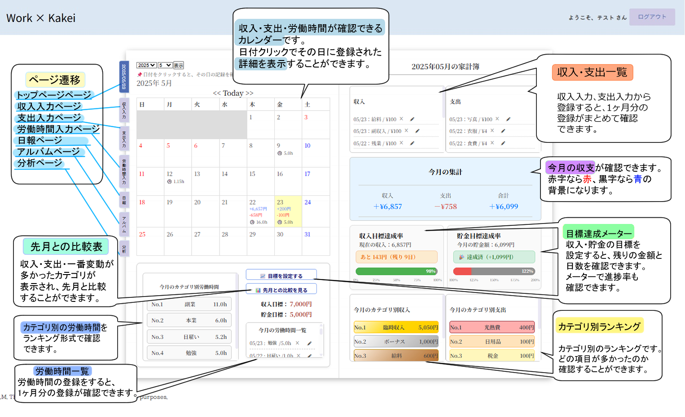
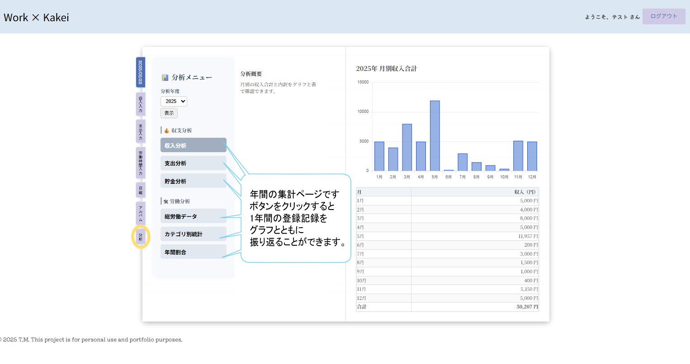

# 💼 Work × Kakei（家計簿・労働管理アプリ）
### 🛠️“働く”を記録する、“暮らし”が変わる。労働特化型家計簿アプリ🛠️
このアプリは、収入・支出・貯金の記録に加え、労働時間の管理と分析にも対応した統合型の家計管理ツールです。
カテゴリ別の集計や月間目標設定、タグ付き画像による視覚的な記録補助を通じて、働き方と資産状況の関連性を可視化し、継続的な改善を支援します。
家計簿に労働記録の機能を組み合わせることで、生活と労働の両面から個人の経済活動を最適化します。

---

## 📖 アプリの機能紹介
## 機能ページ案内

### トップページ

### アルバムページ

### 日報ページ

### 分析ページ


## コンテンツ紹介
### 収入の登録
収入を登録できます。
選択するカテゴリについて初期設定では[-給料 -副収入 -臨時収入]が設定されています。
自分の好きなカテゴリを5個まで増やすことが可能です。
メモ(任意)を書いた場合、日報ページでメモを確認できます。
[](https://gyazo.com/f4d0a389ab2abf258a35415b1179ec1b)

### 支出の登録
支出を登録できます。
選択するカテゴリについて初期設定では
[-食費 -外食費 -交通費 -衣服 -交際費 -通信費 -日用品 -税金 -医療費 -保険 -光熱費 -住居費 -趣味]
が設定されています。
自分の好きなカテゴリを10個まで増やすことが可能です。
支出登録の際、画像も一緒に登録できます。
選択したカテゴリと登録年月が自動タグ付けされます。(削除可)
好きなタグを入力し、追加することも可能です。
メモ(任意)を書いた場合、日報でメモを確認できます。
[](https://gyazo.com/ced9f7b4f1c6119ff61cdce4afaeb900)

### 労働時間の登録
労働時間を登録できます。
選択するカテゴリについて初期設定では[-本業 -副業 -日雇い]が設定されています。
自分の好きなカテゴリを5個まで増やすことが可能です。
労働日報(任意)を書いた場合、日報ページでメモを確認できます。
[](https://gyazo.com/f9ac2ab9a65673f1003aa10fa37d3de0)

### 目標の登録
収入と貯金額の目標を設定できます。
月単位での登録が可能です。
登録すると右のページにあるメーターで
進捗率が確認できます。
目標を達成すると300％までメーターに
達成率が表示されます。
[](https://gyazo.com/fd6f8b8b296a64c31d13b4633ca1b2ea)


### 分析
年間単位の情報を確認することができます。
収入・支出・貯金・総労働時間・カテゴリ別労働時間・年間割合情報を
グラフと表とともに確認ができるページです。
[](https://gyazo.com/61d14a1bda66357f08b48c821cf2277a)

### 使用感
* 日付別詳細機能
* 先月比較モーダル
  
カレンダーの日付をクリックするとその日登録したものの
詳細を確認することができます。
先月比較モーダルでは、先月と比較した収支と特に増減の多かった
カテゴリを確認することができます。
[](https://gyazo.com/942db310cbf9e0265c803236734db3e4)


* 日報ページのメモ一覧

カテゴリ別の画面遷移ボタンを用意しました。
クリックすると、該当のカテゴリのみを表示させメモを確認できます。
長いメモは「続きを読む」より全文表示できます。
[](https://gyazo.com/03b128e218a0cc8cdd5dddf623413b64)


* アルバムページのタグ機能

使用頻度の高いタグは、アルバムページに10個並びます。
タグの一覧・管理より、タグ名をクリックすると、該当の画像のみの表示にもできます。
タグの一括削除、一括編集も可能です。
[](https://gyazo.com/36bfac2e3ab9b74332c2493b1b728127)

---

## 🛠️制作期間
### 実作業日数(主要機能15日+調整5日)

---
## 🏗️ 主な使用技術

* 💎 **言語**: Ruby 3.2.0  
* 📜 **言語**: JavaScript  
* 🧰 **フレームワーク**: Ruby on Rails 7.1.0  
* 🔐 **認証**: Devise  
* 🗄️ **データベース**: MySQL（開発） / PostgreSQL（本番）  
* 🖼️ **ファイル添付**: ActiveStorage  
* 🏷️ **タグ機能**: acts-as-taggable-on  
* 📊 **グラフ描画**: Chartkick + Groupdate  
* 📅 **カレンダー表示**: simple_calendar  
* 🎨 **CSS/UI**: CSS  
* 🚀 **デプロイ環境**: Render  
* ✅ **テスト**: RSpec(モデルのテスト済み) 
* 🗂️ **バージョン管理**: GitHub  
  
---

## 📦 モデル構成と概要

### 👤 User（ユーザー）

* Deviseで管理されるアカウント
* 各種データの所有者

```ruby
has_many :expenses
has_many :incomes
has_many :work_times
has_many :monthly_goals
has_many :category_expenses
has_many :category_incomes
has_many :category_work_times
```

---

### 💰 Income（収入）

* 金額・カテゴリ・労働時間・メモの登録が可能

| カラム名                 | 型         | Options         | Constraints           |
| -------------------- | --------- | --------------- | --------------------- |
| date                 | date      | null: false     | 必須                    |
| amount               | integer   | null: false     | 0円以上、最大2,147,483,647円 |
| category_income_id   | integer   | null: false, FK | カテゴリID            |
| memo                 | text      |                 | 任意、300文字以内            |
| user_id              | reference | null: false, FK | 所属ユーザー                |

```ruby
belongs_to :user
belongs_to :category_income
has_many :work_times
```

### 💸 Expense（支出）

* 金額・カテゴリ・メモの登録が可能
* タグ付き画像を複数登録可能

| カラム名                  | 型         | Options         | Constraints  |
| --------------------- | --------- | --------------- | ------------ |
| date                  | date      | null: false     | 必須           |
| amount                | integer   | null: false     | 0円以上         |
| category_expense_id   | integer   | null: false, FK | カテゴリID   |
| memo                  | text      |                 | 任意、300文字以内   |
| tag_list              | string    |                 | カンマ区切りの任意タグ群(画像ありの場合) |
| user_id               | reference | null: false, FK | 所属ユーザー       |

```ruby
belongs_to :user
belongs_to :category_expense
has_many :tagged_images
```

---

### ⏱️ WorkTime（労働時間）

* 日別の労働記録
* 労働日報を記録できる

| カラム名                     | 型         | Options         | Constraints      |
| ------------------------ | --------- | --------------- | ---------------- |
| date                     | date      | null: false     | 必須               |
| minutes                  | integer   | null: false     | 1分以上、整数          |
| category_work_time_id    | integer   | optional, FK    | カテゴリID |
| user_id                  | reference | null: false, FK | 所属ユーザー           |
| report                   | text |               | 所属ユーザー           |

```ruby
belongs_to :user
belongs_to :category_work_time
```
---

### 🏷️ TaggedImage（画像付きタグ）

* 支出と紐づいた画像＋タグ

```ruby
has_one_attached :image
acts_as_taggable_on :tags
belongs_to :expense
```

| カラム名        | 型             | Options         | Constraints       |
| ----------- | ------------- | --------------- | ----------------- |
| image       | ActiveStorage |                 |  |
| tag_list    | string        |                 | |
| expense_id  | integer       | null: false, FK | 支出と関連付け           |

---


### 🎯 MonthlyGoal（月間目標）

* 収入・貯金の目標を月単位で管理

```ruby
belongs_to :user
```

| カラム名          | 型         | Options                             | Constraints |
| ------------- | --------- | ----------------------------------- | ----------- |
| year          | integer   | null: false                         | 2000年以降     |
| month         | integer   | null: false                         | 1〜12        |
| income_goal  | integer   | allow_nil                          | 0円以上        |
| savings_goal | integer   | allow_nil                          | 0円以上        |
| user_id      | reference | null: false, unique by year & month | 月ごとに1件まで    |

---

### 📚 Category Models（カテゴリ共通仕様）

#### CategoryIncome / CategoryExpense / CategoryWorkTime

* 共通カテゴリは削除不可
* ユーザーごとに作成上限あり
* 名前20文字以内、重複不可

| カラム名     | 型         | Options      | Constraints    |
| -------- | --------- | ------------ | -------------- |
| name     | string    | null: false  | 一意（同一ユーザー内）    |
| user_id | reference | optional, FK | nil の場合は共通カテゴリ |

```ruby 
CategoryIncome
belongs_to :user
has_many :incomes
```
```ruby
CategoryExpense
belongs_to :user
has_many :expenses
```
```ruby
 CategoryWorkTime
belongs_to :user
has_many :work_times
```
---
## 🗂️ ER図


---


## 🧭 画面遷移図


---

##  制作者

* T・M（個人学習・ポートフォリオ用途）

---
